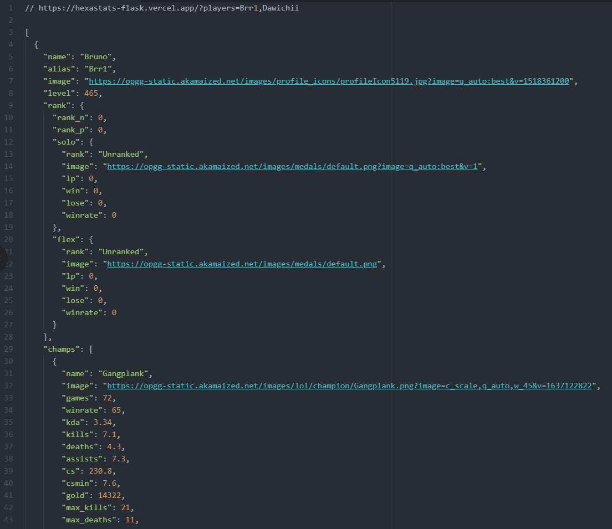

<h1 align="center">Hexastats</h1>

<div align="center">
  </span><span> <span> </span>
</div>

Flask app. Scrapes [op.gg](https://www.op.gg/) and [lol.estiah](https://www.https://lol.estiah.com/) with BS4 to fetch stats and data about League of Legends players and serves it as a JSON through a web API. 


<h2 align="center">More info</h2>

This is a backend made for our [Dawichi/hexastats](https://github.com/Dawichi/hexastats) frontend project, a React + D3.js website to visualize all this data.

🎉🎉🎉 Check it on [hexastats.vercel.app](https://hexastats.vercel.app)


<h2 align="center">API Documentation</h2>

#### GET: One player data 

````python
?players=<name>

# Example: ?players=Bruno
# returns JSON:
[
    {player.data}
]
````


#### GET: Multiple player data 

````python
?players=<name1>,<name2>
?players=<name1>,<name2>,
?players=<name1>, <name2>

# Example: ?players=David ,Alex, Cristian,
# returns JSON: 
[
    {player1.data},
    {player2.data},
    {player3.data}
]

# NOTE: trailing commas and spaces between names in GET param allowed
````





